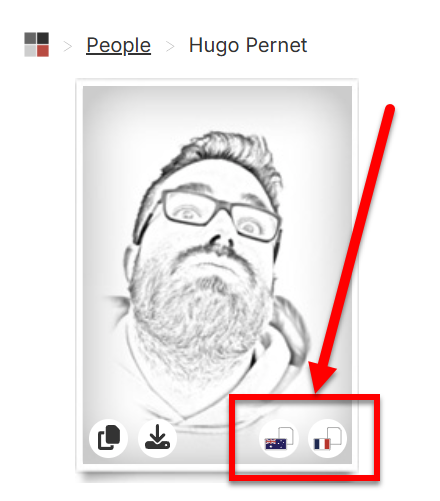

# SSW.People.Profiles.CopyExtension

Chrome Extension to copy SSW employee profiles and format them for French clients.

## Features

- Adds an additional copy button on SSW profile pages  
- Formats the profile data specifically for French audience emails  
- Works alongside the existing on-site copy feature

## Installation

1. Clone or download this repository  
2. Open Google Chrome and navigate to [chrome://extensions/](chrome://extensions/)  
3. Enable **Developer mode** (top-right corner)  
4. Click **Load unpacked** and select the project folder  

## Usage

1. Visit an SSW profile page  
2. Hover over the profile picture  
3. Click the new icon in the bottom-right corner to copy the formatted data  

## Screenshot

